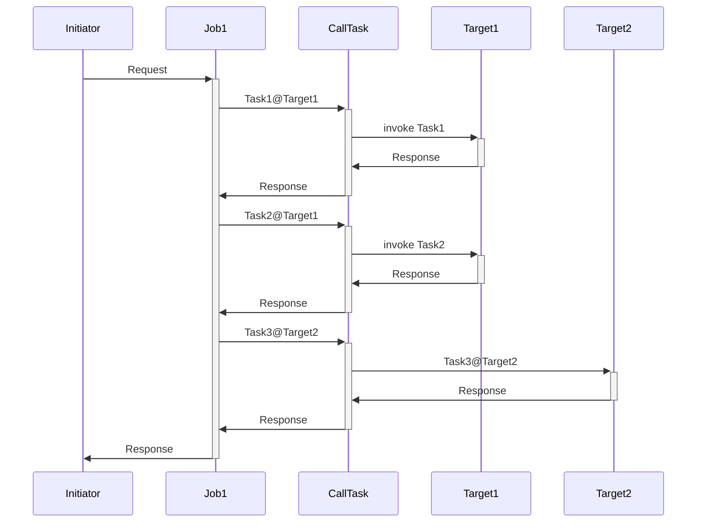

# jobmanagement

## 導入方法
```bash
$ git clone https://github.com/IRISMeister/jobmanagement.git
$ cd jobmanagement/main
$ docker-compose build
```
## 実行方法
```bash
$ docker-compose up -d
```
管理ポータルにアクセスします。ユーザ名/パスワードは _SYSTEM/SYSです。

プロダクション画面  
http://localhost:9203/csp/job/EnsPortal.ProductionConfig.zen?$NAMESPACE=JOB&PRODUCTION=Task.Production1  

リモートでのタスク実行のターゲットとなるIRISサーバ#1  
http://localhost:9204/csp/sys/%25CSP.Portal.Home.zen?$NAMESPACE=TASK  

リモートでのタスク実行のターゲットとなるIRISサーバ#2  
http://localhost:9205/csp/sys/%25CSP.Portal.Home.zen?$NAMESPACE=TASK  

## 停止方法
```bash
$ docker-compose stop
or
$ docker-compose down
```
## 内容



[タスクマネージャー](http://localhost:9203/csp/sys/op/%25CSP.UI.Portal.TaskInfo.zen?$ID1=1000)が、[Initiator](job/src/Task/Service/Initiator.cls)を呼び出す[ユーザ定義のタスク](job/src/SysTask/Job1.cls) を5分ごとに起動します。Initiatorは、[BP/Job1](http://localhost:9203/csp/job/EnsPortal.BPLEditor.zen?BP=Task.Process.Job1.bpl)を起動し、さらにBO/target1, BO/target2を呼び出していることが確認できます。  

BO/Target1はRESTクライアントを使用して、IRISサーバ#1のRESTサービスを起動します。 その結果、IRISサーバ#1では[MyTask.NewClass1](task/src/MyTask/NewClass1.cls)と[MyTask.NewClass2](task/src/MyTask/NewClass2.cls)が、各々実行されます。  
```
$ docker-compose exec task iris session iris -U task
^MyTask=10
^MyTask(1)=$lb("05/17/2023 14:55:00","MyTask.NewClass1","1","abc",5,"","","")
^MyTask(2)=$lb("05/17/2023 14:55:05","MyTask.NewClass2",1,"abc",5,"","","")
^MyTask(3)=$lb("05/17/2023 15:00:00","MyTask.NewClass1","18","abc",5,"","","")
^MyTask(4)=$lb("05/17/2023 15:00:05","MyTask.NewClass2",18,"abc",5,"","","")
^MyTask(5)=$lb("05/17/2023 15:05:00","MyTask.NewClass1","35","abc",5,"","","")
^MyTask(6)=$lb("05/17/2023 15:05:05","MyTask.NewClass2",35,"abc",5,"","","")
^MyTask(7)=$lb("05/17/2023 15:10:00","MyTask.NewClass1","52","abc",5,"","","")
^MyTask(8)=$lb("05/17/2023 15:10:05","MyTask.NewClass2",52,"abc",5,"","","")
^MyTask(9)=$lb("05/17/2023 15:15:00","MyTask.NewClass1","69","abc",5,"","","")
^MyTask(10)=$lb("05/17/2023 15:15:05","MyTask.NewClass2",69,"abc",5,"","","")
TASK>h
```

BO/Target2はRESTクライアントを使用して、IRISサーバ#2のRESTサービスを起動します。 その結果、IRISサーバ#2では[MyTask.NewClass3](task/src/MyTask/NewClass3.cls)が、各々実行されます。  

```
$ docker-compose exec task2 iris session iris -U task
TASK>zw ^MyTask
^MyTask=5
^MyTask(1)=$lb("05/17/2023 14:55:05","MyTask.NewClass3",1,"abc",5,"","","")
^MyTask(2)=$lb("05/17/2023 15:00:05","MyTask.NewClass3",18,"abc",5,"","","")
^MyTask(3)=$lb("05/17/2023 15:05:05","MyTask.NewClass3",35,"abc",5,"","","")
^MyTask(4)=$lb("05/17/2023 15:10:05","MyTask.NewClass3",52,"abc",5,"","","")
^MyTask(5)=$lb("05/17/2023 15:15:05","MyTask.NewClass3",69,"abc",5,"","","")
```

手動でその他のパターンを実行出来ます。
```
$ docker-compose exec job iris session iris -U job test1   (Job1)
$ docker-compose exec job iris session iris -U job test2   (Job2)
$ docker-compose exec job iris session iris -U job test3   (Job3)
$ docker-compose exec job iris session iris -U job test4   (Job4, ワークフローが介在します)
```

To try workflow engine, run the following command.  It forces devision by zero error in MyTask.NewTask2.cls and triggers workflow engine.  This command will be blocked until you perform workflow actions in Analytics/user portal while logging into as _SYSTEM user.
```
$ docker-compose exec job iris session iris -U job error1
```
Typical action would be 'Accept' and 'Abort', which aborts the blocked BP.  Then you will receive something like this.
```
output=6@Task.Response.CallJob  ; <OREF>
+----------------- general information ---------------
|      oref value: 6
|      class name: Task.Response.CallJob
|           %%OID: $lb("221","Task.Response.CallJob")
| reference count: 2
+----------------- attribute values ------------------
|       %Concurrency = 1  <Set>
|            EndTime = "2020-12-01 16:28:55"
|    JobErrorMessage = "<Ens>ErrBPLThrownFault:TaskFault"
|          JobStatus = "NG"
|          StartTime = "2020-12-01 16:24:10"
+-----------------------------------------------------
$
```

## How to edit with VSCode
Select "Open Workspace..." and open jobmanagement.code-workspace file.  
It uses workspace to handle two IRIS namespaces and connections.
You will see three folders.  
<PRE>
main 
 docker-compose file. Merge cpf file.
job
 files for namespace JOB
task
 files for namespace TASK
</PRE>
