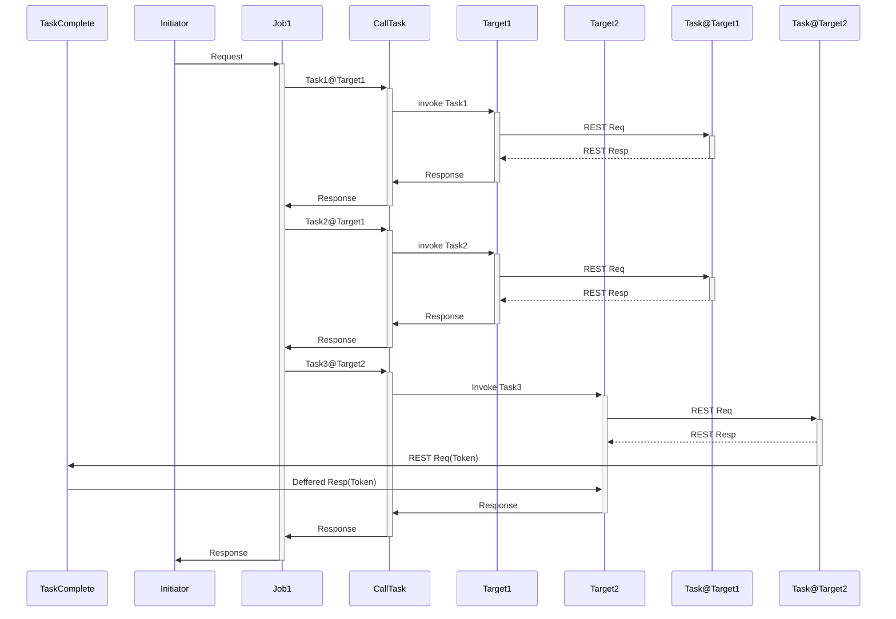
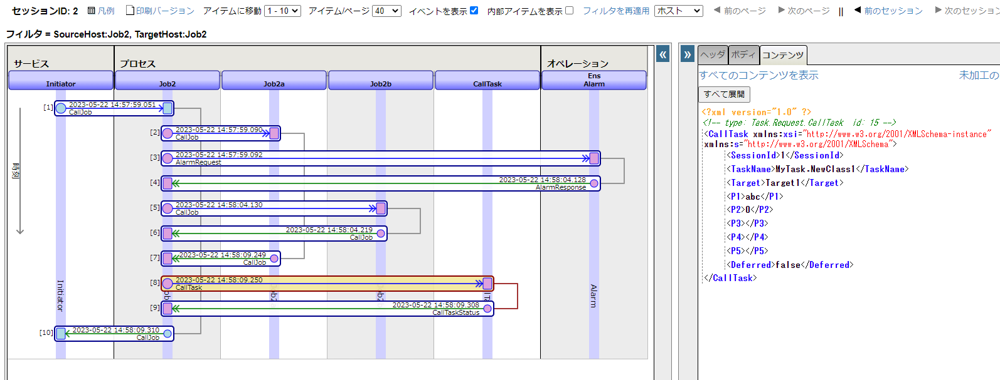
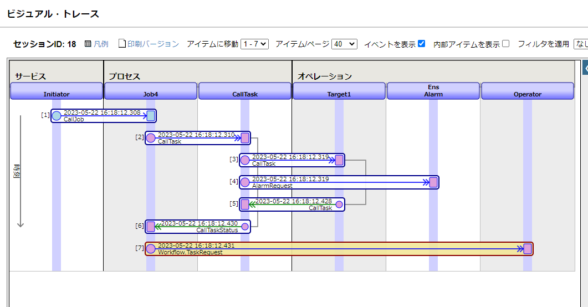
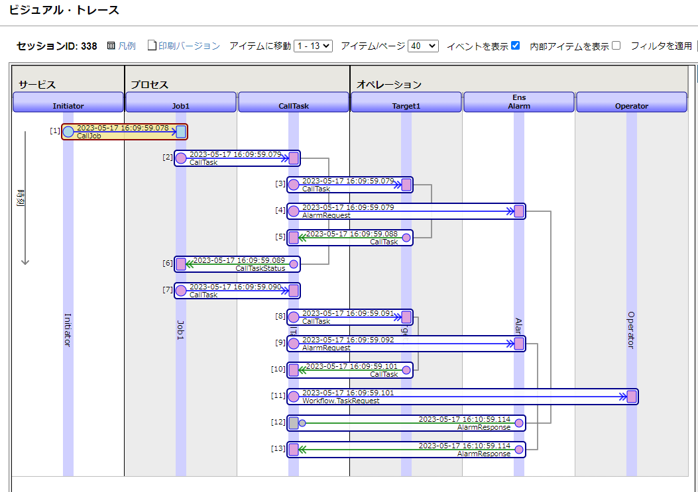
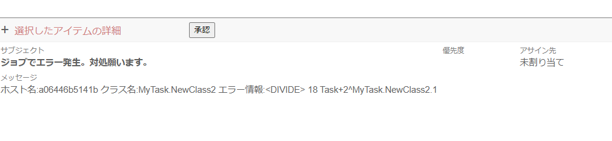
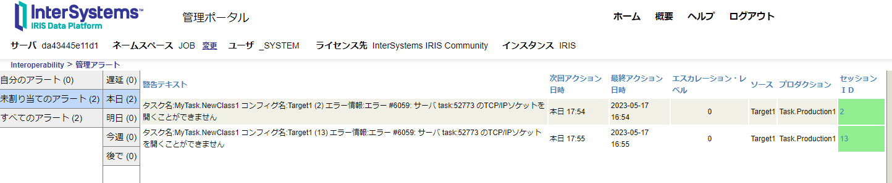

# jobmanagement

# 導入方法
```bash
$ git clone https://github.com/IRISMeister/jobmanagement.git
$ cd jobmanagement/main
$ docker compose build
```
# 実行方法
```bash
$ docker compose up -d
```
管理ポータルにアクセスします。ユーザ名/パスワードは _SYSTEM/SYSです。

プロダクション画面  
http://localhost:9203/csp/job/EnsPortal.ProductionConfig.zen?$NAMESPACE=JOB&PRODUCTION=Task.Production1  

リモートでのタスク実行のターゲットとなるIRISサーバ#1  
http://localhost:9204/csp/sys/%25CSP.Portal.Home.zen?$NAMESPACE=TASK  

リモートでのタスク実行のターゲットとなるIRISサーバ#2  
http://localhost:9205/csp/sys/%25CSP.Portal.Home.zen?$NAMESPACE=TASK  

# 停止方法
```bash
$ docker compose stop
or
$ docker compose down
```
# 各ジョブの処理内容

共通事項として、BP/JobXは、タスクを呼び出す際には、BP/CallTaskに対してリクエストを出す、もしくはBP/CallTaskを実行する他のBPを呼び出すかのいずれかとなります。
## JOB1 

### 起動方法

[JOB1](job/src/SysTask/Job1.cls)は、コンテナ起動直後より[タスクマネージャ](http://localhost:9203/csp/sys/op/%25CSP.UI.Portal.TaskInfo.zen?$ID1=1000)->[BP/Initiator](job/src/Task/Service/Initiator.cls)経由で5分間隔で自動実行されています。

### 処理内容

BP/CallTask経由でtask1(ターゲット:BO/Target1,MyTask.NewClass1), task2(ターゲット:BO/Target1,MyTask.NewClass2), task3(ターゲット:BO/Target2,MyTask.NewClass3)を順番に同期実行。ただし、task3だけは遅延実行(taskインスタンス上でのタスクをJOBコマンドで実行し、遅延応答(トークン)を返却します)を行っています。

BO/Target1はRESTクライアントを使用して、IRISサーバ#1のRESTサービスを起動します。 その結果、IRISサーバ#1では[MyTask.NewClass1](task/src/MyTask/NewClass1.cls)と[MyTask.NewClass2](task/src/MyTask/NewClass2.cls)が、各々実行されます。その動作結果はグローバルに保存されます。 

BO/Target2はRESTクライアントを使用して、IRISサーバ#2のRESTサービスを起動します。 その結果、IRISサーバ#2では[MyTask.NewClass3](task/src/MyTask/NewClass3.cls)が実行されます。その動作結果はグローバルに保存されます。 




### 処理結果

その結果、IRISサーバ#1(コンテナ task)上には、下記の2個(JOB1は5分ごとに自動起動されるので、時間経過とともに数は増えます)のグローバルが保存される。

```
docker compose exec task iris session iris -UTASK
TASK>zw ^MyTask
^MyTask=6
^MyTask(1)=$lb("05/22/2023 13:35:00","MyTask.NewClass1","1","abc",5,"","","")
^MyTask(2)=$lb("05/22/2023 13:35:05","MyTask.NewClass2",1,"abc",5,"","","")
^MyTask(3)=$lb("05/22/2023 13:40:00","MyTask.NewClass1","18","abc",5,"","","")
^MyTask(4)=$lb("05/22/2023 13:40:05","MyTask.NewClass2",18,"abc",5,"","","")
^MyTask(5)=$lb("05/22/2023 13:45:00","MyTask.NewClass1","35","abc",5,"","","")
^MyTask(6)=$lb("05/22/2023 13:45:05","MyTask.NewClass2",35,"abc",5,"","","")
```

その結果、IRISサーバ#2(コンテナ task2)上には、下記の1個(JOB1は5分ごとに自動起動されるので、時間経過とともに数は増えます)のグローバルが保存される。
```
docker compose exec task2 iris session iris -UTASK

TASK>zw ^MyTask
^MyTask=3
^MyTask(1)=$lb("05/22/2023 13:35:05","MyTask.NewClass3",1,"abc",5,"","","")
^MyTask(2)=$lb("05/22/2023 13:40:05","MyTask.NewClass3",18,"abc",5,"","","")
^MyTask(3)=$lb("05/22/2023 13:45:05","MyTask.NewClass3",35,"abc",5,"","","")
```

## JOB2

> 以降のジョブのマニュアル起動および結果の確認作業は、JOB1の自動起動が有効のままだと分かりにくくなるので、いったん[タスクスケジュール](http://localhost:52873/csp/sys/op/%25CSP.UI.Portal.TaskSchedule.zen?$NAMESPACE=JOB&$NAMESPACE=JOB)でJob1を一時停止するのが良いです。

### 起動方法

```
$ docker compose exec job iris session iris -U job job2   (BP/Job2)
```

### 処理内容

BP/job2aを非同期呼び出し後、指定された時間("PT5S", 5秒)だけBPを停止、その後,BP/job2bを非同期実行し、双方の完了を待つ。双方が正常終了した場合にのみ、task1(ターゲット:target1,MyTask.NewClass1)を起動する。  

BP/job2aはtask1(ターゲット:target1,MyTask.SlowTask)を実行します。  
> MyTask.SlowTaskは10秒間sleepして、時間がかかる処理を再現しています。

BP/job2bはtask1(ターゲット:target1,MyTask.FastTask)を実行します。  

下記のトレースにおいて、Job2->Job2aへのCallへの応答はその10秒後になっている(SlowTaskが10秒かかるため)こと、Job2->Job2bへのCall発生はJob2aへのコールの5秒後(PT5Sの指定による)となっていること(その応答は即時になっている)、Job2->CallTaskへのCallは、双方が完了した後となっていることが確認出来ます。




### 処理結果

その結果、taskホスト(コンテナ)上には、下記の3個のグローバルが保存されます。
> タイムスタンプはタスクの完了時刻。

```
docker compose exec task iris session iris -UTASK
TASK>zw ^MyTask
^MyTask=3
^MyTask(1)=$lb("05/22/2023 14:58:04","MyTask.FastTask","1","abc",0,"","","")
^MyTask(2)=$lb("05/22/2023 14:58:09","MyTask.SlowTask","1","abc",0,"","","")
^MyTask(3)=$lb("05/22/2023 14:58:09","MyTask.NewClass1",1,"abc",0,"","","")
```

## JOB3

ほぼBP/JOB2と同じ処理ですが簡易版です。BP/JOB2はBP/JOB2a, BP/JOB2bの呼び出しを行っていますが、JOB3はBP/CallTaskを直接使用しています。

### 起動方法

```
$ docker compose exec job iris session iris -U job job3   (BP/Job3)
```

### 処理内容

task1(ターゲット:BO/Target1,MyTask.SlowTask), task2(ターゲット:BO/Target1,MyTask.FastTask)を非同期(並列)で実行し、双方の完了を待つ。双方が正常終了した場合にのみ, task3(ターゲット:BO/Target1,MyTask.NewClass1)を同期実行。

### 処理結果

その結果、taskホスト(コンテナ)上には、下記の3個のグローバルが保存されます。

```
docker compose exec task iris session iris -UTASK
TASK>zw ^MyTask
^MyTask(4)=$lb("05/22/2023 15:24:45","MyTask.FastTask","22","abc",0,"","","")
^MyTask(5)=$lb("05/22/2023 15:24:55","MyTask.SlowTask","22","abc",0,"","","")
^MyTask(6)=$lb("05/22/2023 15:24:55","MyTask.NewClass1",22,"abc",0,"","","")
```

## JOB4 

### 起動方法

```
$ docker compose exec job iris session iris -U job job4   (BP/Job4)
```

job4はワークフローが介在します。そのためBPの処理は[ユーザポータル](http://localhost:9203/csp/job/_DeepSee.UserPortal.Home.zen)にて、人によるアクションがとられるまで保留されます。その結果、端末は応答待ち状態になります。

### 処理内容

BP/CallTask経由でtask1(ターゲット:BO/Target1,MyTask.NewClass1)を同期実行します。その後、ワークフローを起動して、オペレータの指示待ち状態になります。指示が得られ次第、, task2(ターゲット:BO/Target1,MyTask.NewClass2)を同期実行します。



ワークフロー受信箱に届いているメッセージを選択し、その保留状態を解除すれば、処理が再開します。

### 処理結果

```
docker compose exec task iris session iris -UTASK
TASK>zw ^MyTask
^MyTask(3)=$lb("05/22/2023 16:18:12","MyTask.NewClass1","15","abc",0,"","","")
^MyTask(4)=$lb("05/22/2023 16:19:38","MyTask.NewClass2",15,"abc",0,"","","")
```

## ERROR1
### 起動方法

```
$ docker compose exec job iris session iris -U job error1  (BP/Job1)
```

### 処理内容

JOB1を使用しますが、error1を使用すると、疑似的にアプリケーションレベルのエラーを発生させることができます。MyTask.NewTask2.cls内で強制的にゼロ除算エラーを発生させます。エラー情報は、ワークフローの要求に変換され、オペレータの指示待ち状態になります。そのため処理は、オペレータにより何らかのアクションがとられるまで保留されます。



ワークフロー受信箱に届いているメッセージを選択し、対処方法を指示すれば、処理が再開します。



対処の選択肢には、再実行(エラーが発生したコール、今回のケースではMyTask.NewTask2.clsを呼び出す2番目のBP/CallTask->Target1コール、から再実行する)、継続(エラーを無視して継続する、今回のケースではMyTask.NewTask3.clsを呼び出す、BP/CallTask->Target2コールから処理を継続する)、中止(残りの処理の実行を中止して、BP/Job1を終了する)があります。

> 今回のゼロ除算エラーは何度実行しても発生するので、「継続」を選択します。これで先ほど保留されていたBPが再開し、次の処理(BO/Target2の呼び出し)に進み、端末に結果が表示されます。

```
output=6@Task.Response.CallJob  ; <OREF>
+----------------- general information ---------------
|      oref value: 6
|      class name: Task.Response.CallJob
|           %%OID: $lb("289","Task.Response.CallJob")
| reference count: 2
+----------------- attribute values ------------------
|       %Concurrency = 1  <Set>
|            EndTime = "2023-05-17 16:21:21"
|    JobErrorMessage = ""
|          JobStatus = "OK"
|          StartTime = "2023-05-17 16:09:59"
+-----------------------------------------------------
$
```
## 強制的なエラーの発生と管理アラート

特定のIRISサーバを停止することで、通信相手がダウンしている状況を発生させることが出来ます。

### 起動方法

```
$ docker compose exec task iris stop iris quietly
```
この場合、所定の回数リトライ後にBOがタイムアウトを起こし、[管理アラート](http://localhost:9203/csp/job/EnsPortal.ManagedAlerts.zen?$NAMESPACE=JOB&$NAMESPACE=JOB&)が発生します。

> 対処内容に応じて適宜、内容を更新することを想定した機能です。



BPの処理については、先ほどと同様に、ユーザポータルでワークフロー受信箱に届いているメッセージを選択し、対処方法を指示すれば、処理が再開します。
