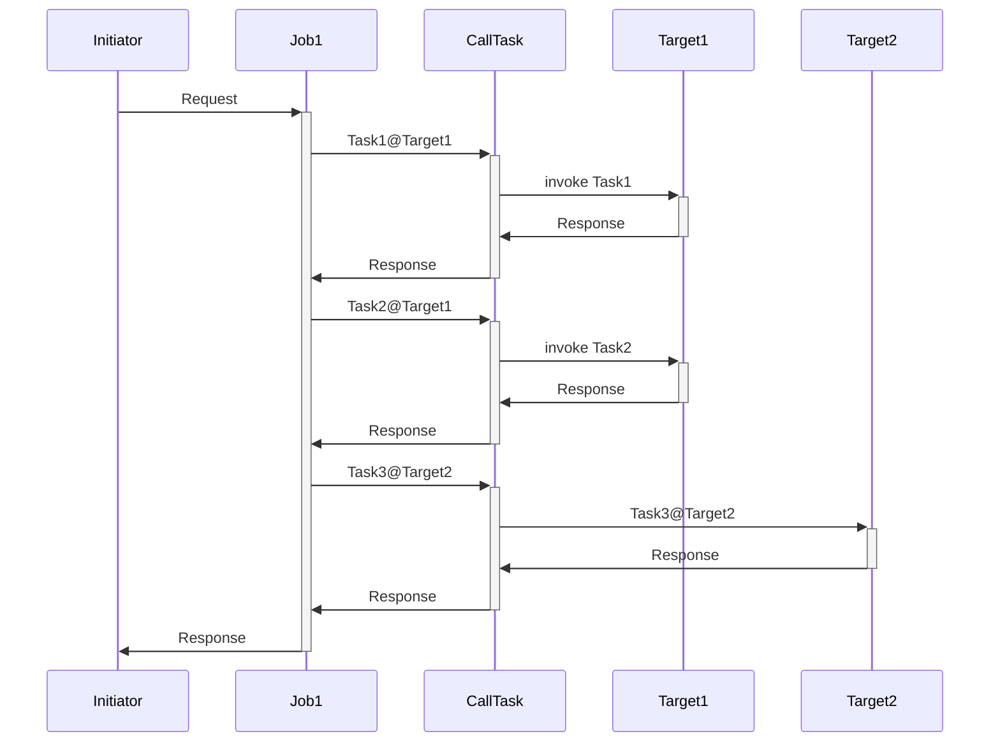

# jobmanagement

## 導入方法
```bash
$ git clone https://github.com/IRISMeister/jobmanagement.git
$ cd jobmanagement/main
$ docker-compose build
```
## 実行方法
```bash
$ docker-compose up -d
```
管理ポータルにアクセスします。ユーザ名/パスワードは _SYSTEM/SYSです。

プロダクション画面  
http://localhost:9203/csp/job/EnsPortal.ProductionConfig.zen?$NAMESPACE=JOB&PRODUCTION=Task.Production1  

リモートでのタスク実行のターゲットとなるIRISサーバ#1  
http://localhost:9204/csp/sys/%25CSP.Portal.Home.zen?$NAMESPACE=TASK  

リモートでのタスク実行のターゲットとなるIRISサーバ#2  
http://localhost:9205/csp/sys/%25CSP.Portal.Home.zen?$NAMESPACE=TASK  

## 停止方法
```bash
$ docker-compose stop
or
$ docker-compose down
```
## 内容



[タスクマネージャー](http://localhost:9203/csp/sys/op/%25CSP.UI.Portal.TaskInfo.zen?$ID1=1000)が、[Initiator](job/src/Task/Service/Initiator.cls)を呼び出す[ユーザ定義のタスク](job/src/SysTask/Job1.cls) を5分ごとに起動します。Initiatorは、[BP/Job1](http://localhost:9203/csp/job/EnsPortal.BPLEditor.zen?BP=Task.Process.Job1.bpl)をCallTask経由で起動し、さらにBO/target1, BO/target2を呼び出しています。  

BO/Target1はRESTクライアントを使用して、IRISサーバ#1のRESTサービスを起動します。 その結果、IRISサーバ#1では[MyTask.NewClass1](task/src/MyTask/NewClass1.cls)と[MyTask.NewClass2](task/src/MyTask/NewClass2.cls)が、各々実行されます。その動作結果はグローバルに保存されています。 
```
$ docker-compose exec task iris session iris -U task
^MyTask=10
^MyTask(1)=$lb("05/17/2023 14:55:00","MyTask.NewClass1","1","abc",5,"","","")
^MyTask(2)=$lb("05/17/2023 14:55:05","MyTask.NewClass2",1,"abc",5,"","","")
^MyTask(3)=$lb("05/17/2023 15:00:00","MyTask.NewClass1","18","abc",5,"","","")
^MyTask(4)=$lb("05/17/2023 15:00:05","MyTask.NewClass2",18,"abc",5,"","","")
^MyTask(5)=$lb("05/17/2023 15:05:00","MyTask.NewClass1","35","abc",5,"","","")
^MyTask(6)=$lb("05/17/2023 15:05:05","MyTask.NewClass2",35,"abc",5,"","","")
^MyTask(7)=$lb("05/17/2023 15:10:00","MyTask.NewClass1","52","abc",5,"","","")
^MyTask(8)=$lb("05/17/2023 15:10:05","MyTask.NewClass2",52,"abc",5,"","","")
^MyTask(9)=$lb("05/17/2023 15:15:00","MyTask.NewClass1","69","abc",5,"","","")
^MyTask(10)=$lb("05/17/2023 15:15:05","MyTask.NewClass2",69,"abc",5,"","","")
TASK>h
```

BO/Target2はRESTクライアントを使用して、IRISサーバ#2のRESTサービスを起動します。 その結果、IRISサーバ#2では[MyTask.NewClass3](task/src/MyTask/NewClass3.cls)が、各々実行されます。その動作結果はグローバルに保存されています。 

```
$ docker-compose exec task2 iris session iris -U task
TASK>zw ^MyTask
^MyTask=5
^MyTask(1)=$lb("05/17/2023 14:55:05","MyTask.NewClass3",1,"abc",5,"","","")
^MyTask(2)=$lb("05/17/2023 15:00:05","MyTask.NewClass3",18,"abc",5,"","","")
^MyTask(3)=$lb("05/17/2023 15:05:05","MyTask.NewClass3",35,"abc",5,"","","")
^MyTask(4)=$lb("05/17/2023 15:10:05","MyTask.NewClass3",52,"abc",5,"","","")
^MyTask(5)=$lb("05/17/2023 15:15:05","MyTask.NewClass3",69,"abc",5,"","","")
```

手動でその他のパターンを実行出来ます。
```
$ docker-compose exec job iris session iris -U job test1   (BP/Job1)
$ docker-compose exec job iris session iris -U job test2   (BP/Job2)
$ docker-compose exec job iris session iris -U job test3   (BP/Job3)
$ docker-compose exec job iris session iris -U job test4   (BP/Job4)
$ docker-compose exec job iris session iris -U job error1  (BP/Job1)
```

test4はワークフローが介在します。そのため処理は[ユーザポータル](http://localhost:9203/csp/job/_DeepSee.UserPortal.Home.zen)にて、人による何らかのアクションがとられるまで保留されます。

ワークフロー受信箱に届いているメッセージを選択し、その保留状態を解除すれば、処理が再開します。

error1を使用すると、疑似的にアプリケーションレベルのエラーを発生させることができます。Job1経由で実行されるMyTask.NewTask2.cls内で強制的にゼロ除算エラーを発生させます。そのため処理は[ユーザポータル](http://localhost:9203/csp/job/_DeepSee.UserPortal.Home.zen)にて、人による何らかのアクションがとられるまで保留されます。

ワークフロー受信箱に届いているメッセージを選択し、対処方法を指示すれば、処理が再開します。


対処には、再実行(エラーが発生したコールから再実行する)、継続(エラーを無視して継続する)、中止(残りの処理の実行を中止する)があります。

> 今回のゼロ除算エラーは何度実行しても発生するので、「継続」を選択します。これで先ほど保留されていたBPが再開し、次の処理(BO/Target2の呼び出し)に進み、端末に結果が表示されます。

```
output=6@Task.Response.CallJob  ; <OREF>
+----------------- general information ---------------
|      oref value: 6
|      class name: Task.Response.CallJob
|           %%OID: $lb("289","Task.Response.CallJob")
| reference count: 2
+----------------- attribute values ------------------
|       %Concurrency = 1  <Set>
|            EndTime = "2023-05-17 16:21:21"
|    JobErrorMessage = ""
|          JobStatus = "OK"
|          StartTime = "2023-05-17 16:09:59"
+-----------------------------------------------------
$
```

特定のIRISサーバを停止することで、システムレベルの障害を発生させることが出来ます。
```
$ docker-compose exec task iris stop iris quietly
```
この場合、所定の回数リトライ後にBOがタイムアウトを起こし、[管理アラート](http://localhost:9203/csp/job/EnsPortal.ManagedAlerts.zen?$NAMESPACE=JOB&$NAMESPACE=JOB&)が発生します。

> 対処内容に応じて適宜、内容を更新することを想定した機能です。


BPの処理については、先ほどと同様に、ユーザポータルでワークフロー受信箱に届いているメッセージを選択し、対処方法を指示すれば、処理が再開します。
